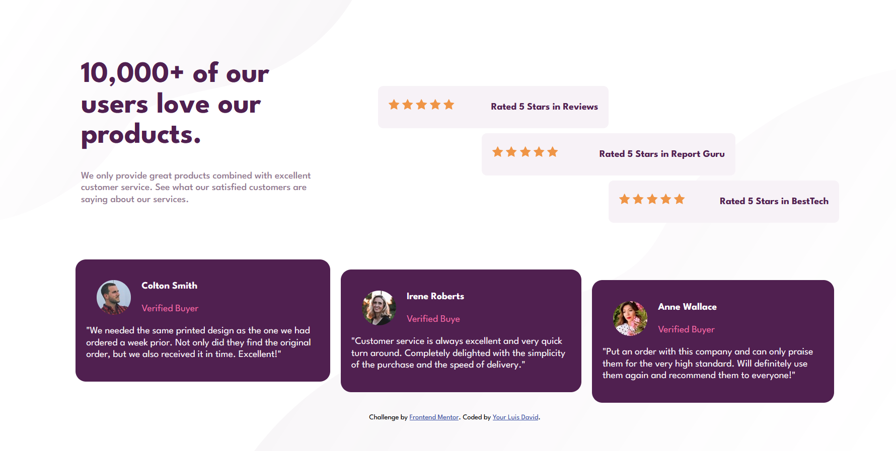
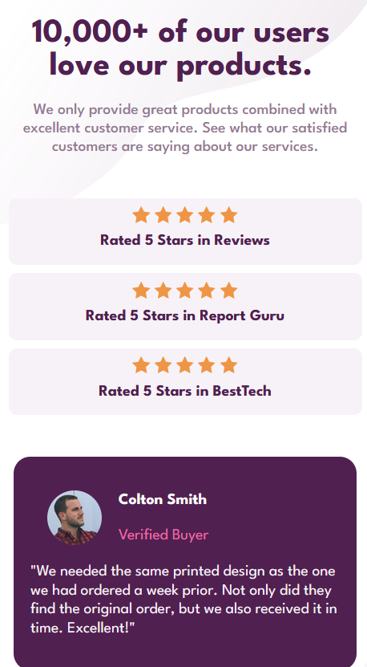

# Frontend Mentor - Social proof section solution

This is a solution to the [Social proof section challenge on Frontend Mentor](https://www.frontendmentor.io/challenges/social-proof-section-6e0qTv_bA)

## Table of contents

- [Overview](#overview)
  - [The challenge](#the-challenge)
  - [Screenshot](#screenshot)
- [My process](#my-process)
  - [Built with](#built-with)
  - [What I learned](#what-i-learned)
- [LinkedIn](#linkedin)
- [Acknowledgments](#acknowledgments)

**Note: Delete this note and update the table of contents based on what sections you keep.**

## Overview

The challenge is about the creation of a responsive front page

### The challenge

Users should be able to:

- View the optimal layout for the section depending on their device's screen size

### Screenshot

## My process

First comparing the model of 1440px and 370px, was to identify the main sections of the page which would be 2 in this case.
One for the upper section and the other for the card section.

### Built with

- Semantic HTML5 markup
- CSS custom properties
- Flexbox
- CSS Grid
- Mobile-first workflow

### What I learned

I learned in this challenge the use of flexbox, using the align-self to position the items inside the flexbox.
And the use of the background style to add two backgrounds at the same time.

## LinkedIn

[David Perez](https://www.linkedin.com/in/david-perez-688a18192?lipi=urn%3Ali%3Apage%3Ad_flagship3_profile_view_base_contact_details%3BtzwyZ0jnS%2BuD6JogRM%2FNoQ%3D%3D)

## Acknowledgments

I like to tanks to [Coding Tube](https://www.youtube.com/c/CodingTube) for their excelent tutorials.
